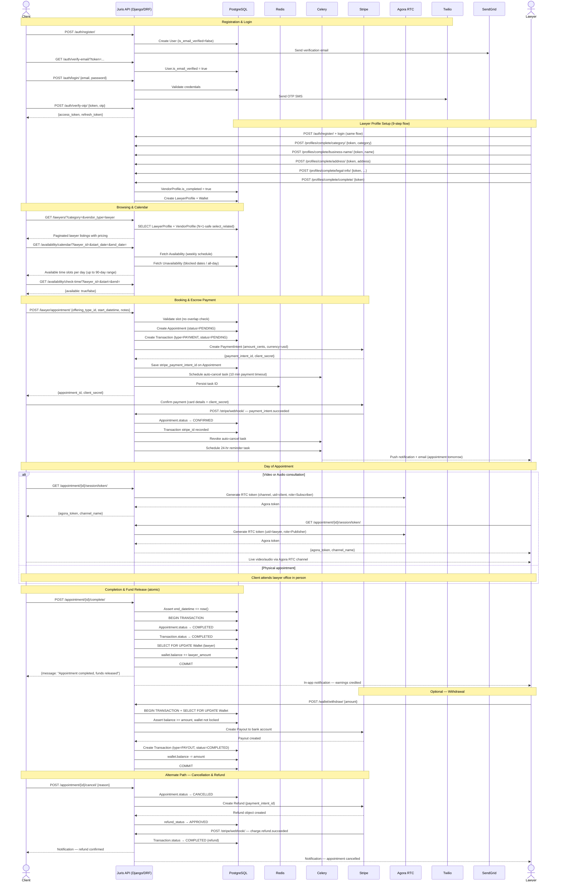
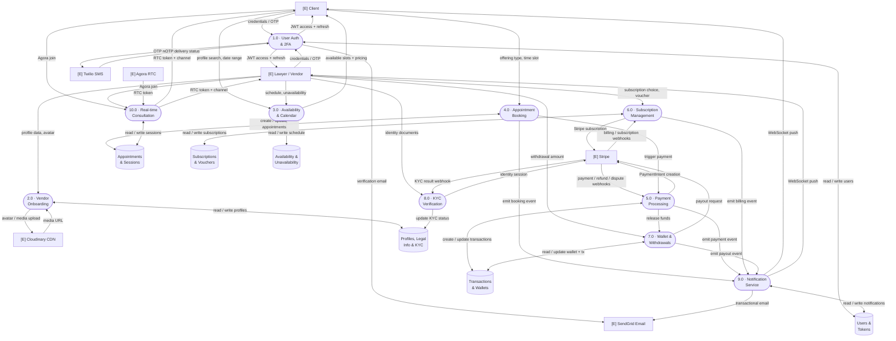
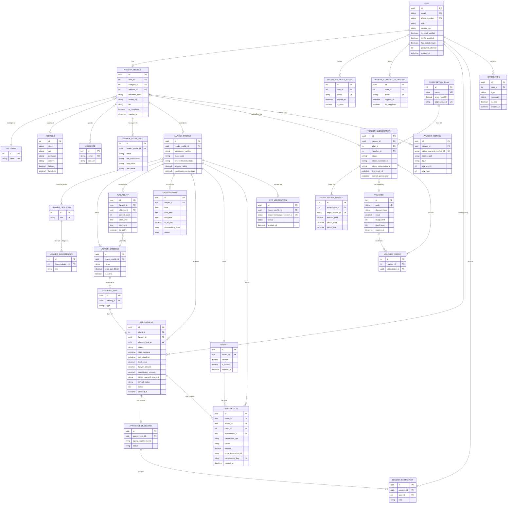

# Juris - System Diagrams

All diagrams are written in [Mermaid](https://mermaid.js.org/)

## 1. Sequence Diagram - Appointment Lifecycle

Full flow from registration through booking, payment, video consultation, and fund release. Cancellation/refund path shown as an alternate.

## 2. Data Flow Diagram (DFD)

Level-1 DFD showing data flows between external entities, system processes, and data stores.

## 3. Use Case Diagram

Actors and their system capabilities across all platform features.

```mermaid
flowchart LR
    %% ── Actors ───────────────────────────────────────────
    C(["👤\nClient"])
    L(["👤\nLawyer / Vendor"])
    A(["👤\nAdmin"])
    ST(["⚙️\nStripe"])
    TW(["⚙️\nTwilio"])

    subgraph SYS ["⬜  Juris Platform"]
        direction TB

        subgraph AUTH ["Authentication & Account"]
            R1["Register & Verify Email"]
            R2["Login with 2FA (SMS OTP)"]
            R3["Sign In with Google OAuth2"]
            R4["Enable / Disable 2FA"]
            R5["Reset Password via Email"]
            R6["Check Email Availability"]
        end

        subgraph CLIENT_UC ["Client Features"]
            CU1["Browse & Search Lawyers"]
            CU2["Filter by Category / Type"]
            CU3["View Lawyer Profile & Pricing"]
            CU4["View Availability Calendar"]
            CU5["Check Specific Time Slot"]
            CU6["Book Appointment"]
            CU7["Pay via Stripe"]
            CU8["Join Video / Audio Call (Agora)"]
            CU9["Mark Appointment Complete"]
            CU10["Cancel Appointment & Refund"]
            CU11["Reschedule Appointment"]
            CU12["View Appointment History"]
        end

        subgraph VENDOR_UC ["Lawyer / Vendor Features"]
            VU1["Complete 9-Step Vendor Profile"]
            VU2["Set Offerings & Pricing Plans"]
            VU3["Add Physical / Audio / Video Types"]
            VU4["Set Weekly Availability Schedule"]
            VU5["Block Unavailability Dates"]
            VU6["Bulk Create / Copy Availability"]
            VU7["Conduct Video / Audio Consultation"]
            VU8["View Wallet Balance & History"]
            VU9["Request Payout / Withdrawal"]
            VU10["Subscribe to Platform Plan"]
            VU11["Apply Voucher Discount Code"]
            VU12["Save Payment Method (Card)"]
            VU13["Complete KYC Identity Verification"]
        end

        subgraph ADMIN_UC ["Admin / Platform"]
            AU1["Approve Withdrawal Requests"]
            AU2["Manage Subscription Plans"]
            AU3["Handle Stripe Charge Disputes"]
            AU4["Monitor KYC Verifications"]
            AU5["Manage Voucher Codes"]
        end
    end

    %% ── Actor connections ─────────────────────────────────
    C --- R1 & R2 & R3 & R4 & R5 & R6
    C --- CU1 & CU2 & CU3 & CU4 & CU5
    C --- CU6 & CU7 & CU8 & CU9 & CU10 & CU11 & CU12

    L --- R1 & R2 & R3 & R4 & R5
    L --- VU1 & VU2 & VU3 & VU4 & VU5 & VU6
    L --- VU7 & VU8 & VU9 & VU10 & VU11 & VU12 & VU13

    A --- AU1 & AU2 & AU3 & AU4 & AU5

    ST --- CU7 & CU10 & VU9 & VU10 & VU13 & AU3
    TW --- R2 & R4
```

## 4. Entity Relationship Diagram (ER)

Full data model covering all major Django apps: `users`, `profiles`, `lawyer`, `lawyer_availability`, `lawyer_appointment`, `lawyer_wallet`, `subscriptions`, `kyc`.

